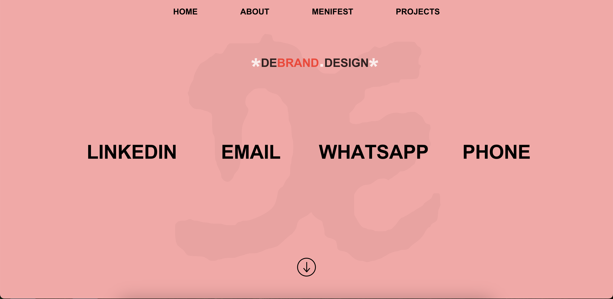

# ✨ DEBRAND – Portfolio Website

---

## 📌 Description

<!-- Interactive portfolio showcasing animations and UX-driven visuals built with Rive & Framer Motion. -->

**DEBRAND** is a frontend portfolio web app designed for high-impact **visual storytelling**, **animated transitions**, and responsive interaction — crafted with a UX-first mindset.

---

## 📸 Preview



**Live site:** [https://debrand-design.vercel.app](https://debrand-design.vercel.app)  
**Code:** [GitHub Repository](https://github.com/GNGscr/debrand-design)

---

## 🧑‍💻 Author

Created by **Daniel Ehrlich**, a **Full Stack Developer** (≈70% Frontend / 30% Backend) with a strong focus on **UX, motion, and user interaction**.  
Responsible for **ideation, UX planning, interface design, animations, dev & deployment** — fully end-to-end.

---

## 🧠 UX Philosophy

This project was built with a **UX-first** and **design-led** development process:

- Clean visual hierarchy with scroll-aware behavior.
- Smooth intro animation that sets tone and pace (using gsap).
- Focus on **motion** and **interactivity** to guide user attention.
- Mobile-specific section hiding to preserve focus.
- Tailored flow for both mouse and touch navigation.

---

## 📐 UX/UI Design Assets

Wireframes, flow, and interaction documentation:

- [`UX_UI.md`](./UX_UI.md)
- [`UX_FLOW.md`](./UX_FLOW.md)
<!-- - [`WIREFRAMES.md`](./WIREFRAMES.md)§ -->

---

## 🎯 Key Features

- 🎞️ **Intro animation** — reveals content in a staged, cinematic way (created with gsap)
- 🧭 **Scroll-based interactivity** — icons and sections transition with movement
- ✨ **Framer Motion animations** — microinteractions, entrance effects, hover
- 📱 **Mobile optimization** — hides certain desktop-only sections
- 🎨 **Consistent branding** — typography, spacing, and flow tightly aligned
- 🧩 **Component-based structure** — all sections modular and reusable

---

## 💡 UX & Interaction Highlights

- 🔁 **Scroll-based menu link color transitions**:
  Navigation menu links shift color dynamically based on scroll position.

- 🪄 **Section entrances**:
  Animated reveals bring sections into view with smooth stagger effects.

- 🖱️ **Hover & motion interactions**:
  Interactive visual responses to user actions for a lively experience.

---

## 🐬 Custom Animation Highlight – Rive Integration

A custom entrance animation of a **waving dolphin** is featured in the Projects section.

- 🎨 **Design**: The dolphin was designed manually in **Figma**, based on inspirational references and adapted to match the app's style and tone.
- 🔧 **Animation**: Animated using **Rive**, an advanced real-time animation engine.
- ⚙️ **Integration**: Controlled via JavaScript and React to match scroll behavior and timing.
- 💡 Originally created for a youth/education-based learning app (volunteer project that was never launched), it was repurposed here to showcase animation capabilities.

This demonstrates:
- Custom asset creation
- Integration of external animation tools in production
- Crafting playful, interactive experiences with attention to performance and UX

---

## 🔍 Summary

Debrand Design showcases a unique fusion of **visual storytelling, animation precision, and minimalist UX structure**.  
It's meant to function as both a portfolio and a product that reflects the developer's values: clarity, creativity, and interactivity.

---

## 🧱 Tech Stack

| Layer       | Technology                         |
|------------|-------------------------------------|
| Frontend   | React 18, Next.js                   |
| Styling    | Tailwind CSS, CSS Modules           |
| Animation  | Framer Motion, gsap                 |
| Deployment | Vercel                              |

---

## 📁 Project Structure

```bash
debrand-design/
├── public/              # Static assets (images, favicon, preview)
├── src/
│   ├── components/      # Modular UI components
│   ├── layout/          # Page layout and shared structure
│   ├── styles/          # Tailwind + CSS modules
│   └── pages/           # Next.js pages (single-page app here)
├── .env.local           # Env variables (optional)
└── package.json         # Dependencies and scripts
```

---

## 🛠️ Installation & Running Locally

> Requires: Node.js 18+, npm or yarn

1. **Clone the repo**
```bash
git clone https://github.com/GNGscr/debrand-design.git
cd debrand-design
```

2. **Install dependencies**
```bash
npm install
# or
yarn install
```

3. **Run the dev server**
```bash
npm run dev
# or
yarn dev
```

Then go to `http://localhost:3000` to view the app.

---

## 🚀 Deployment

- Deployed on **Vercel**
- Optimized for image delivery, scroll performance, and loading behavior

---

## 📜 License

This project is open-source and available under the [MIT License](LICENSE)

---

📬 **For collaboration or feedback**:  
[LinkedIn](https://linkedin.com/in/daniel-ehrlich-36a389136)  
✉️ ehrlichdaniel1@gmail.com / de.brand808@gmail.com
